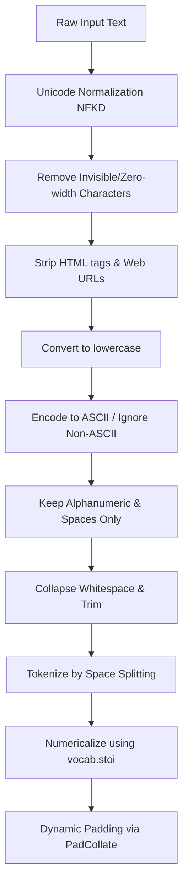

# Sentiment Analysis with BiLSTM in PyTorch, MLflow, and FastAPI

A complete, production-ready sentiment analysis pipeline that leverages a custom **Bidirectional LSTM (BiLSTM)** neural network built with **PyTorch**, tracks experiments and registers models via **MLflow**, and serves predictions through a **FastAPI** web application.

---

## 📂 Project Structure

```text
sentiment-bilstm-pytorch/
├── Data/
│   ├── Raw/
│   │   └── twitter_training.csv                  # Original dataset (Kaggle Twitter Entity Sentiment)
│   └── Processed/
│       └── twitter_training_processed.csv        # Preprocessed dataset (used for training)
├── Src/
│   ├── __init__.py                               # Python package initialization
│   ├── app.py                                    # FastAPI serving application
│   ├── dataset.py                                # Custom Vocab builder, Dataset, and Padding Collate logic
│   ├── model.py                                  # PyTorch BiLSTM Model Architecture
│   └── train.py                                  # Training, evaluation, and MLflow logging/registration pipeline
├── models/                                       # Local storage for vocabulary and best model checkpoints
│   ├── vocab.pkl                                 # Serialized vocabulary instance
│   └── best_bilstm_model.pth                     # Best trained model state weights
├── mlartifacts/                                  # MLflow local artifact repository
├── mlflow.db                                     # SQLite database for MLflow run tracking
├── pyproject.toml                                # Project metadata and dependencies configuration (PEP 621)
└── uv.lock                                       # Dependency lockfile generated by the UV package manager
```

---

## 🛠️ Requirements & Setup

This project uses the modern, ultra-fast **`uv`** package manager. If you don't have `uv` installed, you can use standard `pip` as a fallback.

### 1. Prerequisites
- **Python**: version `3.12` or higher.
- **Git** (optional, for cloning)

### 2. Environment Setup

#### Option A: Using `uv` (Recommended)
`uv` is extremely fast and respects the `uv.lock` file to guarantee identical builds.

```bash
# Initialize/Sync virtual environment and install all dependencies
uv sync

# (Optional) If uvicorn is not in lock, install it:
uv pip install uvicorn
```

#### Option B: Using Standard Python Virtual Environment & `pip`
```bash
# Create virtual environment
python -m venv .venv

# Activate virtual environment
# On Windows:
.venv\Scripts\activate
# On macOS/Linux:
source .venv/bin/activate

# Install dependencies from pyproject.toml
pip install .
pip install uvicorn
```

---

## 🚀 Running the Project (Step-by-Step)

Follow these steps in order to start tracking runs, training the model, and serving it.

> [!IMPORTANT]
> Always ensure your virtual environment is active in the terminal window before executing any command.

### Step 1: Start the MLflow Tracking Server
Before training the model or starting the API server, you must spin up the MLflow tracking service. This service logs hyperparameters, metrics, artifacts, and manages the model registry.

```bash
mlflow ui --host 127.0.0.1 --port 5000 --workers 1
```

- **Host**: `127.0.0.1` (Localhost)
- **Port**: `5000`
- **UI Dashboard**: Open [http://127.0.0.1:5000](http://127.0.0.1:5000) in your browser to view experiment runs and registered models.

---

### Step 2: Train and Register the Model
Run the training pipeline. The script will preprocess text, build the vocabulary, train the BiLSTM model, log validation metrics to MLflow, and automatically register the best performing model weight configuration.

```bash
# Execute the training module
python -m Src.train
```

#### What happens during training?
1. Loads processed Twitter sentiment data from `Data/Processed/twitter_training_processed.csv`.
2. Splits dataset into train and validation sets (80/20 stratified split).
3. Builds text-token vocabulary using `Vocabulary` and saves it locally (`models/vocab.pkl`).
4. Logs parameters to MLflow (`lr=1e-3`, `batch_size=32`, `epochs=20`, embedding/hidden dimensions).
5. For each epoch, runs training and validation, logging `train_loss`, `train_accuracy`, `val_loss`, and `val_accuracy` to MLflow.
6. The model configuration that achieves the lowest validation loss is saved to `models/best_bilstm_model.pth` and uploaded to the MLflow registry under the name **`Sentimental_BiLSTM_Pytorch`**.
7. Vocabulary file `vocab.pkl` is logged as a model artifact.

---

### Step 3: Run the FastAPI Serving Application
Once the model is trained and registered in MLflow, spin up the FastAPI application to serve real-time HTTP prediction requests.

```bash
uvicorn Src.app:app --reload --host 127.0.0.1 --port 8000
```

- **Host**: `127.0.0.1`
- **Port**: `8000`
- **Reload**: Code reloads automatically when files are modified (useful for development).
- **Interactive Documentation (Swagger UI)**: Access [http://127.0.0.1:8000/docs](http://127.0.0.1:8000/docs) to test endpoints directly.

> [!NOTE]
> Upon startup, `Src/app.py` establishes a connection to MLflow at `http://127.0.0.1:5000`, downloads the latest registered model version of `Sentimental_BiLSTM_Pytorch`, downloads its corresponding vocabulary file, and loads them into memory. If the MLflow server is offline, it will automatically fall back to loading from `models/vocab.pkl`.

---

## 🧪 Testing the API

To verify the setup, you can send POST requests to the `/predict` endpoint.

### Example Using `curl` (Command Line)
```bash
curl -X POST "http://127.0.0.1:8000/predict" \
     -H "Content-Type: application/json" \
     -d "{\"text\": \"I absolute love this project! It has changed my entire workflow.\"}"
```

### Example Response
```json
{
  "text": "I absolute love this project! It has changed my entire workflow.",
  "sentiment": "Positive"
}
```

### Supported Sentiment Classes
The output sentiment classification will be one of the following:
- `Positive`
- `Negative`
- `Neutral`
- `Irrelevant`

---

## 🧠 Model Architecture & Processing Details

### 1. Data Preprocessing & Vocabulary Pipeline (`Src/dataset.py`)

To prepare raw textual input for the neural network, the codebase executes a robust, multi-step pipeline using the custom `Vocabulary` and `TextDataset` classes:



#### Detailed Text Cleansing Steps
* **Unicode Normalization**: Runs `unicodedata.normalize('NFKD', text)` to separate base characters from diacritical marks.
* **Invisible Characters Removal**: Uses regex `[\u200b-\u200f\u2028-\u202f\ufeff\u00ad]` to strip zero-width characters, invisible joiners, and soft hyphens.
* **HTML & Link Stripping**: Cleans XML/HTML tags with `<[^>]+>` and removes HTTP/HTTPS/WWW URLs with `https?://\S+|www\.\S+`.
* **ASCII Transcoding**: Runs `.encode('ascii', 'ignore').decode('utf-8')` to strip standalone accented marks and non-ASCII glyphs.
* **Punctuation Stripping**: Discards punctuation by retaining only lowercase characters, integers, and whitespace `[^a-z0-9\s]`.
* **Whitespace Compaction**: Multi-spaces are collapsed to single spaces and stripped of outer margins.

#### Vocabulary Construction & Numericalization
* The vocabulary is constructed from the processed text corpus using `vocab.build_vocab()`.
* **Frequency Thresholding**: Only words appearing $\ge$ `freq_threshold` (default is `1`) are registered to save memory.
* Special index assignments:
  * `0`: `<PAD>` (padding token used to build rectangular batch tensors)
  * `1`: `<UNK>` (out-of-vocabulary fallback token)
  * `2+`: Normal tokens registered during vocabulary building.
* During inference or training lookup, unknown tokens are automatically mapped to index `1` (`<UNK>`).

#### Dynamic Batch Padding (`PadCollate`)
Rather than padding sequences to a fixed global max length (which introduces redundant computations on shorter batches), this project uses a custom `PadCollate` class inside PyTorch's `DataLoader`.
* It calculates the maximum length of sequences *within the active batch*.
* It applies padding dynamically using `torch.nn.utils.rnn.pad_sequence` with `batch_first=True` and `padding_value=0`.

---

### 2. PyTorch BiLSTM Model Architecture (`Src/model.py`)

The class `SentimentBiLSTM` implements a Bidirectional Long Short-Term Memory network designed for sequence classification. Below is the step-by-step tensor flow:

#### Layer Configurations & Parameters
* **Input Layer**: Shape `(Batch Size, Sequence Length)` representing word token indices.
* **Embedding Layer (`nn.Embedding`)**:
  * Dimensions: `vocab_size` $\to$ `embed_dim` (configured to **`64`**).
  * `padding_idx=0` prevents learning vectors for `<PAD>`.
  * Outputs tensor of shape: `(Batch Size, Sequence Length, 64)`.
  * **Dropout (`nn.Dropout(0.3)`)** is applied to the embeddings to mitigate overfitting.
* **Recurrent Layer (`nn.LSTM`)**:
  * Bidirectional: `bidirectional=True` (processes sequences in both left-to-right and right-to-left directions).
  * Layer Depth: `num_layers=2` (stacked LSTMs).
  * Hidden State Size: `hidden_dim` (configured to **`32`**).
  * Dropout between layers: `dropout=0.3`.
  * Output shape: `(Batch Size, Sequence Length, hidden_dim * 2)` (since it is bidirectional).

#### Bidirectional State Aggregation & Dense Projection
```text
  LSTM Final Hidden Tensor [num_layers * num_dirs, Batch, hidden_dim]
                      ├── Shape: [4, Batch, 32]
                      │
                      ├── Slice [index -2] -> Layer 2 Forward State [Batch, 32]
                      └── Slice [index -1] -> Layer 2 Backward State [Batch, 32]
                                     │
                                     ▼ (Concatenate along dim=1)
                        Concatenated State [Batch, 64]
                                     │
                                     ▼ (nn.Dropout 30%)
                        Dropout Tensor [Batch, 64]
                                     │
                                     ▼ (nn.Linear mapping to classes)
                         Final Logits [Batch, 4]
```

* The bidirectional LSTM returns a hidden state tuple `(hidden, cell)`.
* Because `num_layers=2` and `bidirectional=True`, the `hidden` tensor size is `(4, Batch Size, 32)`.
  * `hidden[-2, :, :]` extracts the last forward LSTM layer's state.
  * `hidden[-1, :, :]` extracts the last backward LSTM layer's state.
* The forward and backward hidden states are concatenated using `torch.cat(..., dim=1)` resulting in a flat feature vector of size **`64`** (`hidden_dim * 2`).
* A final dropout is applied, followed by a linear projection (`nn.Linear`) mapping the `64` features to **`4`** classes representing the sentiment logit outputs.

---

### 3. Hyperparameters & Optimization Details (`Src/train.py`)

* **Loss Function**: `nn.CrossEntropyLoss()` which calculates softmax cross-entropy for multi-class classification.
* **Optimizer**: `optim.Adam(model.parameters(), lr=1e-3)` for adaptive gradient learning.
* **Epoch Count**: `20` epochs.
* **Batch Size**: `32`.
* **Evaluation Metrics**: Tracks Accuracy and Validation Loss at the end of each epoch to trigger the checkpoint saver if validation loss improves.
* **Tracking & Logging**: Integrates with MLflow, sending parameters and metrics per epoch directly to the tracking database.

